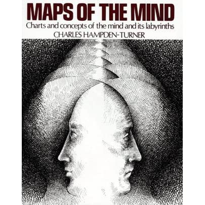
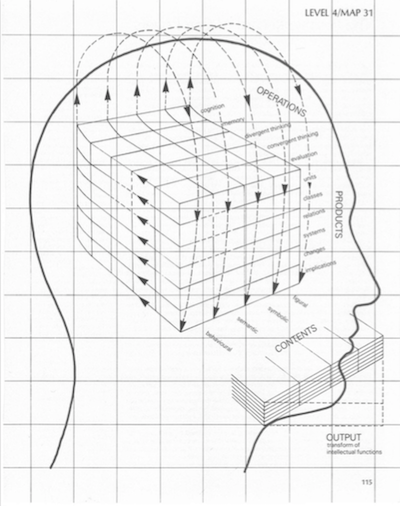
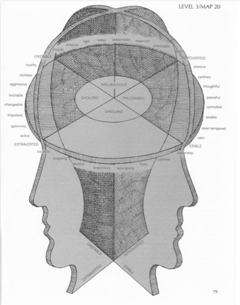
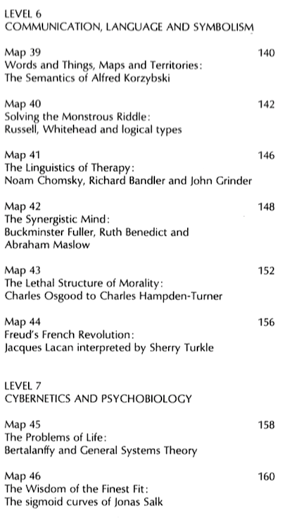

# MoTM

This is a project to convert Charles Hampden-Turner's 1981 **Maps of the Mind** into:

- data models predicated on personal data, usable over personal data vaults, such as [Solid](https://solidproject.org) 
- 3D models, usable in data visualisation, VR, and AR 

Perhaps the most illuminating and extraordinary book about the human mind ever made (in modern times) was published in 1981: Charles Hampden-Turner's **Maps of the Mind**.
  

60 maps, each combining text and a 'map' that is both a schematic and a work of art, represent a survey of theories of the mind in the west. 

Hampden-Turner's work utterly transcends the recent materialist and reductionist debates about consciousness and panentheism, and pulls back the curtains on what we have forgotten in our Moore's Law myopia. 
 
That this book predates the AI revolution and the stunning progress in cognitive science in recent decades in no way lessens its power.Minsky, Dennet, the Churchlands, Damasio, Tononi, etc. - are all just more maps, waiting to be added. 

Keywords: cognitive science, VR, AR, perennial philosophy, Romantic science, classicism, panentheism

